# 🚀 Portfólio Dev  

Aplicação de **portfólio pessoal** desenvolvida para apresentar habilidades, serviços e projetos de destaque.  
O objetivo é mostrar experiência em **desenvolvimento front-end e fullstack**, unindo boas práticas de design e código.  

---

## 🎨 Design (Figma)

Protótipo e especificações disponíveis no Figma:  
[🔗 Acessar o layout](https://www.figma.com/design/TB3W2EgMoGcIPYL3M8PQax/Portfolio-Dev--Community-?node-id=0-1&p=f&m=dev)



---


## 🛠️ Tecnologias Utilizadas

- **HTML5**  
- **CSS3** (Flexbox, Variáveis CSS)  
- **Google Fonts** (`Asap`, `Inconsolata`, `Maven Pro`)  
- **SVGs customizados** (ícones, vetores e thumbnails)  

---

## 📂 Estrutura de Pastas

```
PORTFOLIO-DEV/
├── assets/              # Imagens e ícones SVG
│   ├── Cover.svg
│   ├── face.svg
│   ├── vector.svg
│   ├── HTML.svg
│   ├── CSS.svg
│   ├── JavaScript.svg
│   ├── React.svg
│   ├── Node.js.svg
│   ├── GitHub.svg
│   ├── LinkedinLogo.svg
│   ├── Instagram.svg
│   ├── Email.svg
│   ├── ArrowUpRight.svg
│   ├── CaretDoubleDown.svg
│   ├── Devices.svg
│   ├── HardDrives.svg
│   ├── Infinity.svg
│   ├── Thumbnail_Project-01.svg
│   ├── Thumbnail_Project-02.svg
│   ├── ...
│
├── index.html           # Estrutura HTML principal
├── style.css            # Estilização da página
└── README.md            # Documentação do projeto
```

---


## 📌 Aprendizados

- Criação de layouts com **Flexbox**.  
- Uso de **variáveis CSS** para consistência visual.  
- Aplicação de **pseudo-classes** e **pseudo-elements**.  
- Estruturação semântica com **HTML5**.  

---


